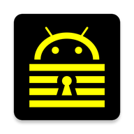

<div align="center">



# 白い熊 鍵暗号

**A KeePass 2.x password manager for Android, restyled head-to-toe in signature black-yellow.**

A fork of [keepass2android](https://github.com/PhilippC/keepass2android) with **major additions**: a per-element theming page (colors and fonts for every surface), a one-ZIP export/import of every setting, a sister-app backup door that checks who is knocking, an app-drawn black-yellow fingerprint dialog, a chronologically merged fork+upstream change log, and the offline-only NoNet build.

Installs **side-by-side** with Keepass2Android (app id `shiroikuma.kagiango`). Built for **arm64-v8a**.

**📥 Latest release: [`1.15-r3+008`](https://github.com/ShiroiKuma0/shiroikuma-kagiango/releases/latest)** — [all releases & APK downloads »](https://github.com/ShiroiKuma0/shiroikuma-kagiango/releases)

</div>

---

## 🎨 白い熊 鍵暗号 UI — theme every element
A dedicated theming page (reachable from Settings, the overflow menu, or a long-press on the settings cog) exposes **per-element color and font slots** for the whole app: unlock screen, entry/group lists, title rows, list icons, buttons/FABs, settings pages, the entry view, and the page itself. An external-font picker renders each font in its own glyphs, and an app-language selector sits on top. Everything seeds to the signature palette — pure `#000000` surfaces, pure `#FFFF00` text, borders, and icons — and re-seeds itself when the palette evolves, without touching your own choices.

## 🖤💛 Black-yellow across every screen
Not just a dark theme: the unlock screen, database chooser, group lists, entry view, settings pages, QuickUnlock, dialogs, the status bar, and the launcher icon all follow the black-yellow palette. Where Material 3 refuses runtime coloring (its ActionBar surface tint), screens carry their own toolbars so the title rows obey the theme too.

## 💾 Export / import every setting — as one ZIP
The first section of the UI page backs the app up and restores it. Tick what you want — colors, fonts (and the font files you imported), display and language, security, QuickUnlock, password access, file handling, TrayTotp, password-generator profiles, debug — and Export writes **a single timestamped ZIP**; Import merges it back key by key, so a restore never destroys what it didn't cover. Categories mirror the app's own settings screens and their keys are read from the preference definitions at runtime, so settings a future upstream adds are carried along automatically.

Because this is a password manager, the export is an **allow-list**: only keys a category claims are ever written, and the biometric unlock's Keystore-wrapped master password and any stored remote-storage logins are excluded outright — on import as well as export, so a hand-edited archive cannot inject a credential back in. Your database, its master password, and the backup folder itself never travel inside a backup.

An archive is built under a `.part` name and renamed only once it is whole, so a run that fails — or is stopped — leaves the backup folder exactly as it found it: no short archive, no stray partial.

A sister app can run the same export **headlessly**. That switch now ships **on** — a phone that has just been wiped has nobody left to configure it — while 「Use authorization token?」 stays off by default and reveals the token only if you actually ask for one; a token sent to an app that isn't asking is ignored rather than refused, so turning one switch off never breaks somebody else's batch. The app states which categories start ticked, so the caller's picker opens on our answer rather than a guess, and a running export can be **cancelled from outside**: it unwinds at the next category boundary and takes its partial file with it.

---

## 🚪 A data door that checks who is knocking
[白い熊 応用管理](https://github.com/ShiroiKuma0) can back this app up **with its settings** and put them back on a wiped phone. That goes through an exported `ContentProvider`, not a broadcast, for a blunt reason: **a broadcast cannot tell you who sent it**, and the caller is the one supplying the destination.

A caller is admitted on three counts, each because the one before it isn't enough: an **exact package name** — never a prefix, because a package name is not a namespace anyone owns and any sideloaded app can call itself `shiroikuma.evil`; the **uid the kernel reports**, which cannot be borrowed the way a declared name can; and a **pinned signing certificate**, because whichever caller isn't installed yet is a name anyone can take — and a freshly wiped phone is exactly where that is true. The backup itself travels through a file descriptor the caller opens, so nothing is ever written to a path we chose. **Restore lives only behind that check** — never on the unauthenticated broadcast, because an import rewrites a password manager's security settings.

And the door is honest about what it hands over: its own self-description ends with *"Settings only — never the database, the master password or a stored login"*. A green backup row can never be mistaken for a backup of your `.kdbx`.

---

## 🫆 App-drawn fingerprint dialog
The system biometric prompt renders outside the app and ignores theming — so the fork draws its own black-yellow fingerprint dialog (yellow-traced icon, themed text, accent Cancel), authenticating through the compat fingerprint API against the same Android-keystore cipher. If the device cannot serve the legacy API, it silently falls back to the system prompt, so unlocking always works.

## 📜 Merged change log
The change-log dialog shows the fork's own dated entries merged chronologically on top of the upstream history — one themed black-yellow timeline of everything, from upstream 0.7 to the newest fork build.

## 📴 Offline-only (NoNet)
Only the **NoNet** flavor is built: no cloud-storage SDKs, no QR scanner, no network permissions beyond what the offline app needs. Your database stays on the device.

---

## Built on keepass2android
A fork of [keepass2android](https://github.com/PhilippC/keepass2android) by Philipp Crocoll (app id `shiroikuma.kagiango`, so it coexists with the official build). Keepass2Android is the reference KeePass 2.x/KeePassXC-compatible password manager for Android, with its portable KeePass core, secure bundled keyboard, and autofill support. The code remains under GPLv3.

## Building
```bash
git clone --recurse-submodules git@github.com:ShiroiKuma0/shiroikuma-kagiango
cd shiroikuma-kagiango            # branch: custom
# prerequisites: dotnet 9 + android workload, nuget, JDK 21, Android SDK + NDK r26d
# (ANDROID_SDK_ROOT / ANDROID_HOME / ANDROID_NDK_ROOT exported; see CLAUDE.md → Building)
./build-scripts/fork-build.sh     # signed NoNet release APK (arm64-v8a)
                                  # → ~/tmp/shiroikuma-kagiango_<version>_arm64-v8a.apk
```
